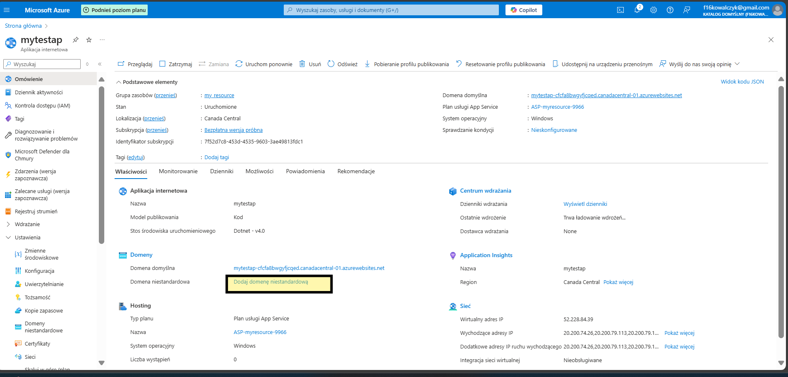
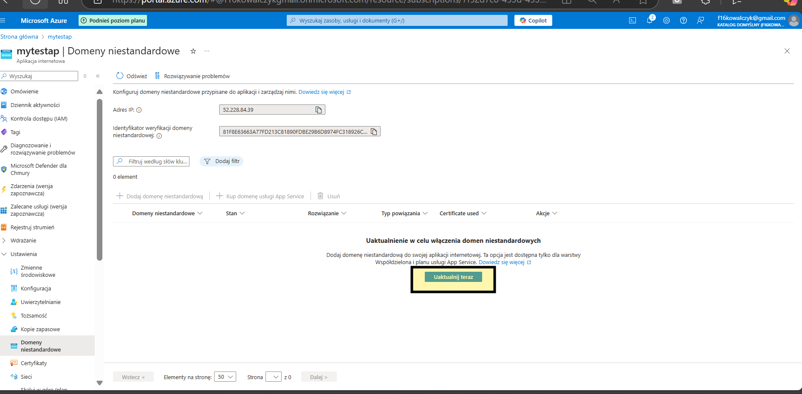
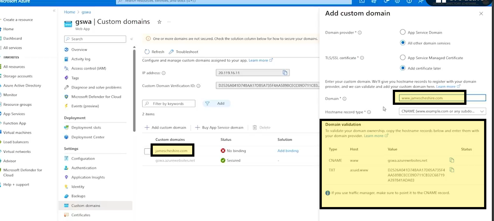

# Azure_add_domain
 How to custom azure domain

If you need custom your domain go to your app and custom your domain:

next update domain

use this config and add below config to your provider

remeber that you most add this info for your domain provider